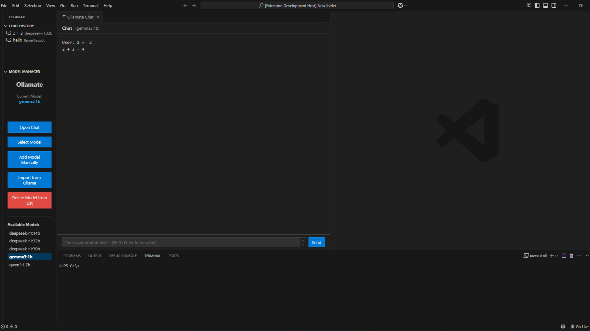

# Ollamate - Your Local LLM Copilot for VS Code

Bring the power of local Large Language Models directly into your Visual Studio Code workflow with Ollamate! Interact seamlessly with models running via [Ollama](https://ollama.com/) without leaving your editor.

## Features

*   **Interactive Chat Panel:** Open a dedicated webview panel to chat with your selected Ollama model.
*   **Model Management Sidebar:**
    *   View a list of available models from your Ollama installation.
    *   Select the active model to use for chats.
    *   Manually add model names to your available list.
    *   Import models directly from your local Ollama instance.
    *   Remove models from your available list.
*   **Chat History Sidebar:**
    *   Automatically saves chat sessions.
    *   View a history of past chat sessions, named by a summary of the first prompt.
    *   Load previous chat sessions to review or continue the conversation.
    *   Delete unwanted chat sessions from the history.
    *   Includes model used and timestamp for each history entry.
*   **Configurable:**
    *   Set a default model for new chat sessions.
    *   Define a default system prompt to be prepended to new chats.
    *   Customize the maximum number of chat sessions stored in history.
    *   (Optionally, if re-added: Configure Ollama API URL and request timeout).
*   **Seamless Integration:** Uses VS Code's UI elements and theme variables for a native look and feel.

## Requirements

*   **Ollama Installed and Running:** You must have Ollama installed and serving models locally. Download and install from [ollama.com](https://ollama.com/).
*   **Models Downloaded:** Ensure you have pulled the models you wish to use via the Ollama CLI (e.g., `ollama pull llama3`).

## Getting Started

1.  **Install Ollamate:** Search for "Ollamate" in the VS Code Extensions view (`Ctrl+Shift+X` or `Cmd+Shift+X`) and click Install.
2.  **Ensure Ollama is Running:** Start your local Ollama server.
3.  **Open the Ollamate Sidebar:** Click on the Ollamate icon (e.g., a hubot icon) in the Activity Bar.
4.  **Manage Models:**
    *   Use the "Model Manager" view to see available models.
    *   Click "Import from Ollama" to populate the list if it's empty.
    *   Select a model using the "Select Model" button.
5.  **Start Chatting:**
    *   Open the chat panel by:
        *   Running the command `Ollamate: Start New Chat` from the Command Palette (`Ctrl+Shift+P` or `Cmd+Shift+P`).
        *   Or, clicking the "Open Chat" button within the Model Manager view.
    *   Type your prompt and press Enter (or click "Send"). Shift+Enter for newlines.
6.  **View Chat History:**
    *   Expand the "Chat History" view in the Ollamate sidebar.
    *   Click on a past session to load it into the chat panel.
    *   Right-click on a session to delete it.

## Extension Settings

This extension contributes the following settings (accessible via File > Preferences > Settings, then search for "Ollamate"):

*   `ollamate.maxHistory`: Maximum number of recent chat sessions to store (Default: `50`).
*   `ollamate.defaultModel`: Default model to use for new chats if none is selected (e.g., `llama3:latest`). Leave empty to use last selected or auto-select.
*   `ollamate.defaultSystemPrompt`: A system prompt prepended to every new chat session.
*   `ollamate.requestTimeout`: Timeout for Ollama API requests in milliseconds (Default: `120000`).

*(Remove or add settings here to match your `package.json`)*

## Known Issues

*   Currently, the timeout setting for API requests might not be fully effective due to limitations in the underlying `ollama-js` library for streaming requests.
*   (Add any other known issues or limitations)

## Contributing

Contributions, issues, and feature requests are welcome! Please feel free to check the [issues page](https://github.com/darrenjoyner/ollamate-ext/issues).

## License

This extension is licensed under the [MIT License](LICENSE.md).
